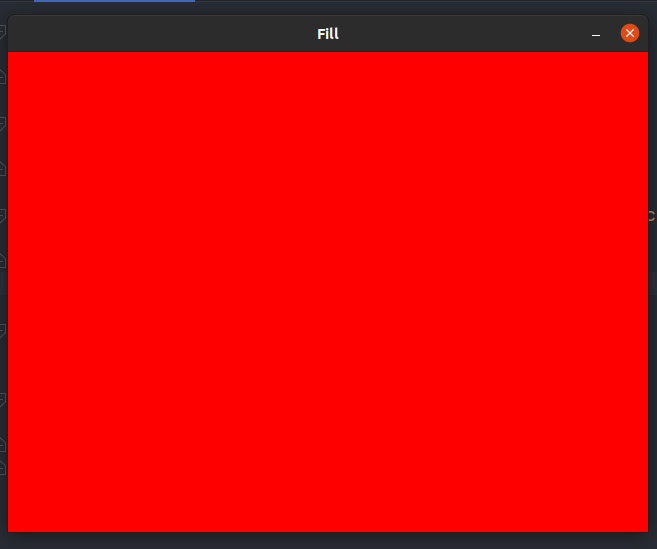

## `Ebiten`

`ebiten`是一个简单的使用纯`go`实现的游戏，使用这个库即可以实现`go`语言代码的学习，又可以实现对游戏编程的了解。

### `Hello world`

让我们以一个`Hello world!`开始`ebiten`的学习，

完整代码实现如下：

```go
package main

import (
	"github.com/hajimehoshi/ebiten"
	"github.com/hajimehoshi/ebiten/ebitenutil"
	"log"
)

type Game struct {
}

func (g *Game) Update() error {

	return nil
}

func (g *Game) Draw(screen *ebiten.Image) {
	ebitenutil.DebugPrint(screen, "Hello world!")
}

func (g *Game) Layout(outsideWidth, outsideHeight int) (screenWidth, screenHeight int) {
	return 320, 240
}

func main() {

	ebiten.SetWindowSize(720, 480)
	ebiten.SetWindowTitle("Hello world!")
	if err := ebiten.RunGame(&Game{}); err != nil {
		log.Fatal(err)
	}

}
```

运行效果如下：


1. 导入所需模块

其中`import`的两个比较重要的库，一个是`"github.com/hajimehoshi/ebiten"`这里面实现的事`ebiten`的核心代码，`"github.com/hajimehoshi/ebiten/ebitenutil"`里面实现的是`ebiten`常用的一些工具库。

2. 定义数据结构体

```go
type Game struct {
}
```

`Game`结构体，该结构体实现了`ebiten.Game`接口。该接口实现了第三步中的三个接口函数：

3. 实现`ebiten.Game`接口

```go
// 图像刷新函数
// 这个接口会按照每秒60(默认)次的频率进行调用
// 这个函数正常运行会一直返回nil的error，当返回非nil值时，你的game将会被挂起
func (g *Game) Update() error {

	return nil
}
//绘图函数
// 没帧图 都会调用Draw函数进行绘制，如果你想要60帧，那你就得每秒调用该函数60次
func (g *Game) Draw(screen *ebiten.Image) {
	ebitenutil.DebugPrint(screen, "Hello world!")
}
// 该接口接受外部尺寸，即桌面尺寸，返回游戏尺寸，即无论桌面尺寸多大，游戏的尺寸是固定的(返回的事固定值)
func (g *Game) Layout(outsideWidth, outsideHeight int) (screenWidth, screenHeight int) {
	return 320, 240
}
```

4. 主函数调用

`ebiten.SetWindowSize(720, 480)`设置窗口大小，要是不设置就使用默认窗口大小。

`ebiten.SetWindowTitle("Hello world!")`设置窗口标题

`ebiten.RunGame(&Game{})`游戏主循环


### `Draw`

完整代码如下：

```go
package main

import (
	"github.com/hajimehoshi/ebiten"
	"image/color"
	"log"
)

type fGame struct {
}

func (g *fGame) Update() error {
	return nil
}

func (g *fGame) Draw(screen *ebiten.Image) {
	screen.Fill(color.RGBA{R: 0xff, A: 0xff})
}

func (g *fGame) Layout(outsideWidth, outsideHeight int) (screenWidth, screenHeight int) {
	return 320, 240
}


func main() {
	ebiten.SetWindowSize(640, 480)
	ebiten.SetWindowTitle("Fill")
	if err := ebiten.RunGame(&fGame{}) ; err != nil {
		log.Fatal(err)
	}
}
```

`screen.Fill(color.RGBA{R: 0xff, A: 0xff})`是一个向窗口中填充颜色的函数，

实现效果：



### 渲染一个图片

完整实现代码：

```go
package main

import (
	"fmt"
	"github.com/hajimehoshi/ebiten"
	"github.com/hajimehoshi/ebiten/ebitenutil"
	_ "image/png"
	"log"
)

var img *ebiten.Image

func init() {
	var err error
	img, _, err = ebitenutil.NewImageFromFile("gopher.png")
	if err != nil {
		fmt.Println("err")
		log.Fatal(err)
	}
}

type rGame struct {
}

func (g *rGame) Update() error {
	return nil
}

func (g *rGame) Draw(screen *ebiten.Image) {
	screen.DrawImage(img, nil)
}

func (g *rGame) Layout(outsideWidth, outsideHeight int) (screenWidth, screenHeight int) {
	return 640, 480
}

func main() {
	ebiten.SetWindowSize(640, 480)
	ebiten.SetWindowTitle("Render an image")
	if err := ebiten.RunGame(&rGame{}); err != nil {
		log.Fatal(err)
	}
}
```

代码运行效果：


这里主要实现了，读取一张图片，并进行绘制


### 如何使用矩阵绘图

这个程序几乎和渲染一个图片一模一样，唯一一点不同的是，增加了`option`参数，并依靠参数，实现了对图像的放大和移动

```go
package main

import (
	"github.com/hajimehoshi/ebiten"
	"github.com/hajimehoshi/ebiten/ebitenutil"
	_ "image/png"
	"log"
)

var mImg *ebiten.Image

func init() {
	var err error
	mImg, _, err = ebitenutil.NewImageFromFile("gopher.png")
	if err != nil {
		log.Fatal(err)
	}
}

type mGame struct {
}

func (g *mGame) Update() error {
	return nil
}

func (g *mGame) Draw(screen *ebiten.Image) {
	op := &ebiten.DrawImageOptions{}
	// 移动像素点 50 50
	op.GeoM.Translate(50, 50)
	// 等比缩放
	op.GeoM.Scale(1.5, 1)
	screen.DrawImage(mImg, op)
}

func (g *mGame) Layout(outsideWidth, outsideHeight int) (screenWidth, screenHeight int) {
	return 640, 480
}

func main() {
	ebiten.SetWindowSize(640, 480)
	ebiten.SetWindowTitle("Geometry Matrix")
	if err := ebiten.RunGame(&mGame{}); err != nil {
		log.Fatal(err)
	}
}
```


